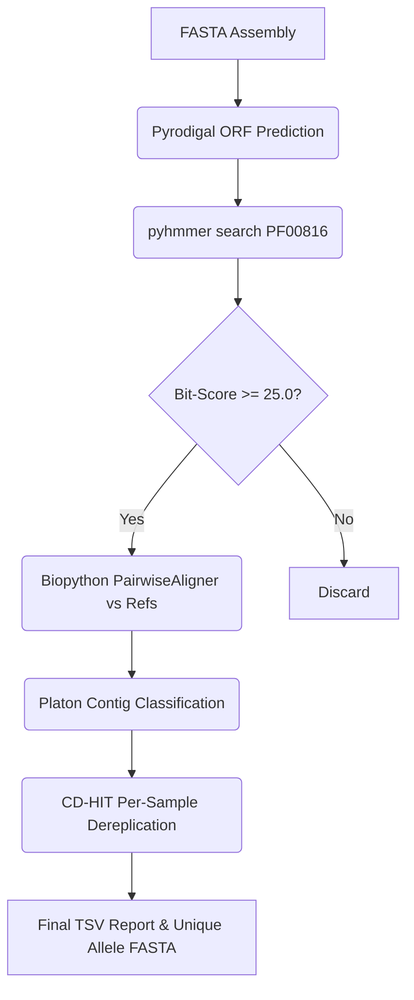

# H-NS & StpA Extraction Pipeline: Data Interpretation Guide

This guide is designed to help researchers interpret the outputs generated by the H-NS/StpA extraction pipeline, providing biological context and technical details for each column in the final report.

## Biological Context

H-NS (Histone-like Nucleoid-Structuring protein) and StpA (Suppressor of td- Phenotype A) are key nucleoid-associated proteins (NAPs) in Enterobacteriaceae, including *Klebsiella pneumoniae*. 
* **H-NS** acts as a global transcriptional silencer, typically binding to AT-rich promoter regions of xenogeneic (foreign) DNA, thus protecting the cell from potentially toxic transgene expression.
* **StpA** is a paralog of H-NS that acts as a molecular back-up or accessory protein. StpA shares significant structural homology with H-NS, is often susceptible to rapid proteolysis when not complexed, and can form heterodimers with H-NS.
* **Plasmid vs. Chromosomal Localization:** While NAPs are predominantly encoded on the bacterial chromosome to regulate core housekeeping functions, plasmid-borne NAPs (e.g., plasmid-encoded H-NS variants) are frequently associated with facilitating the acquisition and stability of virulent or drug-resistant plasmids by silencing their transcription during horizontal gene transfer.

This pipeline automates the identification, structural classification (H-NS vs. StpA), and replication origin analysis (Chromosome vs. Plasmid) of these proteins across large genome assembly datasets.

## Methodology & Pipeline Algorithm

The pipeline executes a multi-stage bioinformatic algorithm to detect, characterize, and localize target proteins from genome assemblies:

1. **Gene Prediction (Pyrodigal):** 
   The pipeline calls `pyrodigal` (a Python binding to `Prodigal`) to predict open reading frames (ORFs) from assembly nucleotide sequences in metagenomic mode (`meta=True`). This step avoids the overhead of file system writes and processes ORFs purely in memory.

2. **H-NS Profile Search (pyhmmer):**
   Predicted protein sequences are digitized and scanned using `pyhmmer` (a Python binding to `HMMER`) against the Pfam profile for the H-NS histone-like nucleoid structuring protein domain (`PF00816.hmm`). Hits are filtered using a bit-score threshold of $\ge 25.0$.

3. **In-Memory Paralog Alignment (Biopython):**
   To distinguish true H-NS proteins from the StpA paralog, the pipeline executes a zero-I/O local alignment search using Biopython's `Bio.Align.PairwiseAligner` with `mode='local'`. Sequences are aligned against canonical *K. pneumoniae* reference templates for H-NS (`HNS.faa`) and StpA (`StpA.faa`). The sequence is classified based on the higher local alignment score, and coverage/identity metrics are computed relative to the reference lengths.

4. **Plasmid Contig Prediction (Platon):**
   Platon is run via Apptainer using a localized container (`platon.sif`) and its reference database. Platon analyzes the contigs containing the verified hits for diagnostic plasmid markers (replication proteins, conjugation machinery, incompatibility groups, etc.). Contigs containing plasmid-specific markers are annotated as `Plasmid`, while the remaining default to `Chromosome` (or `Unknown` if untypeable).

5. **Variant Dereplication (CD-HIT):**
   For each sample, CD-HIT is run via Apptainer (`cd-hit.sif`) on the verified proteins to cluster sequence variants at 100% identity. This produces sample-specific unique allele FASTA files (`{Sample_Name}_unique.faa`), helping resolve gene duplication, multi-copy alleles, and allele diversity.

6. **Parallel Concurrency & Resource Guarding:**
   * **Parallel Scanning and Classification:** Gene prediction and HMMER scanning are distributed across CPU threads using process pools. Platon classifications are run in parallel using a thread pool of Apptainer container execution workers, significantly reducing cohort runtime.
   * **Memory Concurrency Guard:** To prevent Out-Of-Memory (OOM) failures under Slurm workloads, the pipeline monitors `SLURM_MEM_PER_NODE` and dynamically caps the concurrent Platon worker count:
     $$\text{Max Platon Workers} = \max\left(1, \frac{\text{SLURM\\_MEM\\_PER\\_NODE}}{2 \text{ GB}}\right)$$
   * **Checkpointing & Resume Mode:** Each sample writes a `{Sample_Name}.done` empty sentinel and `{Sample_Name}_hits.json` cache file. If a job times out or is cancelled, re-running on the same output directory will instantly skip already-processed genomes and resume execution cleanly.

## Output Report Structure

The final output is a merged tab-separated values (TSV) file (`all_hns_variants_report.tsv` or similar). Below is a breakdown of the columns:

### 1. Genomic Coordinates & Identification
* **`Genome_ID`**: The identifier/sample name of the genome assembly.
* **`Contig_ID`**: The specific contig where the protein-coding gene was identified.
* **`Start` / `Stop`**: The nucleotide coordinates of the predicted open reading frame (ORF) on the contig.
* **`Strand`**: The transcription direction of the ORF (`+` or `-`).
* **`Sequence_Length`**: The length of the predicted amino acid sequence.

### 2. HMM Classification Confidence
* **`Bit_Score`**: The HMMER bit-score showing the match confidence against the Pfam H-NS domain HMM profile (`PF00816.hmm`). Higher scores indicate greater confidence. (Scores $> 25.0$ are used as the extraction threshold).

### 3. Paralog Classification
* **`Predicted_protein`**: Classified as **`H-NS`** or **`StpA`**. This classification is resolved by aligning the extracted protein against canonical reference sequences for *K. pneumoniae* H-NS and StpA using local pairwise alignment. The sequence is assigned to whichever reference yields the higher score.
* **`HNS_cov` / `HNS_identity`**: The coverage and identity percentages of the local alignment against the canonical H-NS reference.
* **`StpA_cov` / `StpA_identity`**: The coverage and identity percentages of the local alignment against the canonical StpA reference.

### 4. Genomic Location
* **`Location`**: The predicted replication origin of the contig carrying the gene:
  * **`Chromosome`**: Platon characterized the contig as chromosomal (lacking plasmid-specific diagnostic markers).
  * **`Plasmid`**: Platon successfully matched plasmid-specific replication, mobilization, conjugation, or incompatibility markers on this contig.
  * **`Unknown`**: Indeterminate prediction, typically occurring on very short contigs where diagnostic markers are absent.

## Example Interpretations

1. **True Chromosomal H-NS**
   * `Predicted_protein`: `H-NS`
   * `Location`: `Chromosome`
   * `HNS_identity`: Higher than `StpA_identity`
   * *Interpretation:* A standard core-genome histone-like structuring protein.

2. **Plasmid-Borne H-NS**
   * `Predicted_protein`: `H-NS`
   * `Location`: `Plasmid`
   * `HNS_identity`: Higher than `StpA_identity`, variable (often divergent from the chromosomal counterpart)
   * *Interpretation:* A plasmid-encoded H-NS variant. These are crucial targets when studying the dissemination of antibiotic resistance genes, as they often modulate the fitness costs of newly acquired plasmids.

3. **StpA Paralog**
   * `Predicted_protein`: `StpA`
   * `Location`: `Chromosome`
   * `StpA_identity`: Higher than `HNS_identity`
   * *Interpretation:* The core-encoded StpA paralog.

## CD-HIT Dereplication Outputs
For each sample, the pipeline performs CD-HIT dereplication at 100% identity, resulting in two main FASTA files per sample:
* **Raw FASTA (`{Sample_Name}.faa`)**: Contains all predicted protein variants extracted from that sample.
* **Unique FASTA (`{Sample_Name}_unique.faa`)**: Contains only the unique, non-redundant sequence alleles (100% identity representatives) for that specific sample. This file, along with the cluster mapping (`{Sample_Name}_unique.faa.clstr`), helps analyze sequence variation and identify gene copy numbers per genome. No global merged FASTA file is produced, preventing sequence cross-contamination between genomes.
